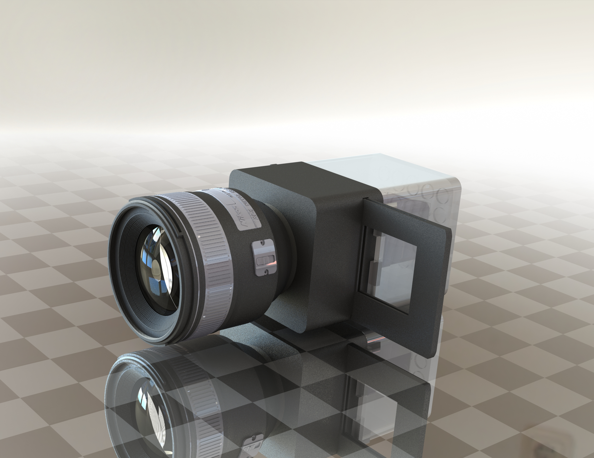

# diy_projector
一个使用尼康f卡口镜头的简易幻灯机，用于投影反转片。

f卡口图纸来源：https://en.wikipedia.org/wiki/Nikon_F-mount

85mm镜头模型（file name: AF-S_85_1.4G.SLDASM）引用自（仅用于渲染效果图）：https://grabcad.com/library/nikon-af-s-85mm-f1-4g

## 效果图

